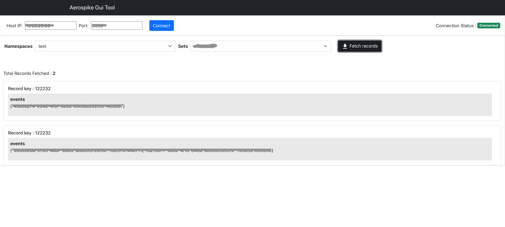

<p>A simple Gui Tool for using Aerospike Db. The project is in porgress. Currently it only supports fetching records.
If you want to contribute, please contact the Author:
</p>



## How to use ?

1. Clone the reporsitory. Do npm install inside the ```server``` and ```aerospike``` folder.
2. Open terminal in server folder and run command ``` npm run start ```.
3. Open one more terminal in aerospike folder and again run ``` npm run start ```.
4. You should now see the Aerospike Gui running on localhost:3000. 


### About Author

    Hey there! I am Vipan kumar, a passionate coder and developer from Hoshiarpur, punjab.

    I have a total of 1.5 years of experience in designing and building web applications. I believe that I can 
    reduce human efforts and make people’s lives easier by developing advanced user-friendly products. I like to 
    develop products that require very minimal human interaction. With the same mindset I have built softwares in 
    my recent organization just for my personal use to reduce the manual labor. My key areas of interests include 
    System designing, Data Management, Event based architecture, etc.

    [LinkedIn 💼](https://www.linkedin.com/in/vipank/")

    [Email 📬](mailto:vipan16116@iiitd.ac.in)
